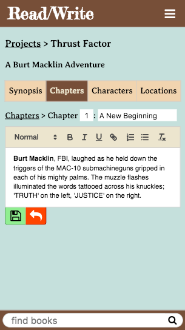
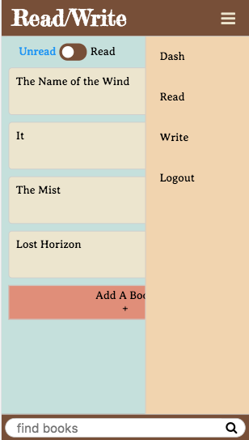
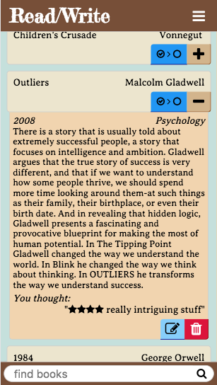
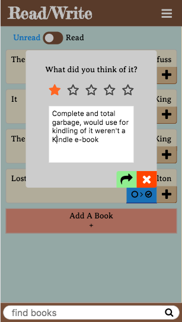

# READ/WRITE

   

## What is Read/Write?

Following up on the smashing success that was The Reading List, the developers (developer) have (has) opted to expand on the premise of enabling those with a passion for the written word. As with The Reading List, users are able to maintain a list of books they would like to read (obtained either through an API search or created themselves), as well as a list of books they have read and what they thought about them. In addition to that, the user are now able to express themselves further by writing their own stories.

That's the "write" in Read/Write.

Users are able to create any number of projects, within which they can write chapters and maintain lists of characters & locations.

## Technical Discussion
This app makes extensive use of `React.js` on the front end to deliver a fairly seamless one-page experience, using axios to make calls to the `Ruby on Rails` backend. It also uses an NPM package called `React-Quill` to render a rich-text editor component for the user to write and format their projects.

I also used the `Google Books API` to allow the user to look up books that they could then add to their list. This API search is done on the back-end using the HTTParty gem for Rails.

## Notes on App Structure

Code Samples

Below handles the rendering of additional book info. It also conditionally renders form fields if the user wishes
to edit the info. I put a lot of effort into making everything display inline and/or conditionally to reduce the number of page changes as much as was practical.
```javascript
<div className="book-single-info">
      {/* either display book information or form fields for editing */}
      {props.bookToEdit === props.book.id ? (
        <div className="book-middle">
          <input
            type="text"
            name="bookGenre"
            value={props.bookGenre}
            placeholder="genre"
            onChange={props.handleInputChange}
          />
          <input
            className='book-year-input'
            maxLength='4'
            type="text"
            name="bookYear"
            value={props.bookYear}
            placeholder="year"
            onChange={props.handleInputChange}
          />
          <input
            type="text"
            name="bookImage"
            value={props.bookImage}
            placeholder="cover image url"
            onChange={props.handleInputChange}
          />
        </div>
      ) : (
        <div className="book-middle">
          <p>{props.book.year}</p>
          <p>{props.book.genre}</p>
        </div>
      )}
      {/* either render book description or a text form field for editing */}
      {props.bookToEdit !== props.book.id ? (
        <div className="book-description">
          <p>{props.book.description}</p>
        </div>
      ) : (
        <div className="book-description">
          <textarea
            rows='10'
            type="text"
            name="bookDescription"
            value={props.bookDescription}
            placeholder="description"
            onChange={props.handleInputChange}
          />
        </div>
      )}
      <div className="book-bottom">
        {props.book.user_rating ? (
          <div className='user-rating'>
            <p>You thought: </p>
            <span>"{renderRating()} {props.book.user_comment}"</span>
          </div>
        ) : ( 
          ''
        )}
        {/* display either edit/delete buttons, or submit and cancel if editing */}
        {props.bookToEdit !== props.book.id ? (
          <div className="links">
            <button className='edit-button' onClick={() => props.setBookToEdit(props.book.id)} title="Edit"><i className="fa fa-pencil-square-o" aria-hidden="true"></i></button>
            <button className='delete-button' onClick={() => props.deleteBook(props.book.id)} title="Delete"><i className="fa fa-trash" aria-hidden="true"></i></button>
          </div>
        ) : (
          <div className="links">
            <button className='submit-button' onClick={() => props.handleBookEditSubmit()} title="Submit"><i className="fa fa-share" aria-hidden="true"></i></button>
            <button className='cancel-button' onClick={() => props.setBookToEdit(null)} title="Cancel"><i className="fa fa-times" aria-hidden="true"></i></button>
          </div>
        )}
      </div>
    </div>
```

I also tried to have a unified design in mind when building it so that I could do something like this to reduce my CSS bloat:
```css
.bookcreateform .buttons,
.book-single .buttons,
.projectcreateform .buttons,
.chaptercreateform .buttons,
.char-loc-createform .buttons,
.char-loc-single .buttons,
.chapter .buttons,
.links {
  display: flex; 
  justify-content: flex-end;
  margin-right: -6px;
  margin-bottom: -6px;
}
```

## The Making of Read/Write

Thanks to Dom for helping me get a little inspiration to give my second project a major mobile upgrade. Also thanks to Phil and Jake for having issues with Httparty so I could learn from their efforts when I implemented my api call. 

## Opportunities for Future Growth

I would like to continue to add forums and/or chatroom functionality to bring it up to par with my second project. I also didn't get around to adding book covers, but I feel like that should be an easy addition.
